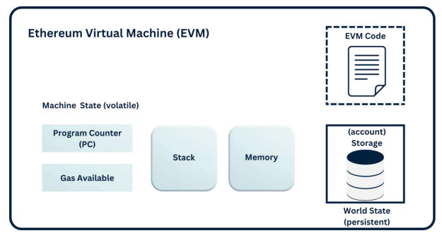

# C1. Introduction to Ethereum
- Ethereum is a decentralized, open-source blockchain platform designed to enable developers to build smart contracts and decentralized applications(DApps).
- A smart contract is a self-executing piece of code with the terms of the agreement directly written into it.
- These contracts automatically enforce and execute agreements without requiring any intermediaries.
> **How has Ethereum changed since the hack?**
> **PoS vs. PoW?***

## Ethreum vs. Bitcoin

## Backbone of Web3

# C2. Ethereum's Blockchain Fundamentals
## Work process
1. Users send transactions
2. Transactions validated by PoS validators
3. Blocks of transaction created and added to the blockchain
4. Smart contracts execute automatically if conditions are met
5. Blockchain updates across all nodes

## Structure of Blocks
1. Block header: metadata such as block number, timestamp, hash of the previous block and a unique block hash
2. Transactions: list of transactions, such as ETH transfers, smart contract interactions, and token swaps
3. State changes: Ethereum maintains a global state, which updates every time a transaction is executed

## Ethereum Transactions
- Sender Address
- Receiver Address
- Amount of ETH (if applicable)
- Gas limit and gas price
- Signature

## Ethereum Virtual Machine (EVM)
- EVM：execution environment for smart contracts and decentralised applications on Ethereum
- Responsible for processing transactions, executing smart contracts, and maintaining the network's decentralised state
- EVM allows Ethereum's code to run identically across all nodes.

### Ethereum's Consensus Mechanism: Proof-of-Stake (PoS)
   1. Validators stake at least 32 ETH to participate
   2. A validator is randomly selected to propose the next block
   3. Other validators verify and approve the block before it is added to the blockchain
   4. Validators earn rewardsfor securing the network but lose a portion of their stake if they act maliciously

# C3. Ethereum's Architecture
## EVM: the execution layer

1. EVM Code
2. Machine State(volatile)
   1. Porgram Counter
   2. Gas Available
   3. Stack
   4. Memory
3. World State (persistent)
   1. Account Storage

## Ethereum Nodes and Their Role in the Network
Computers that store the blockchain and validate transactions: full nodes, light nodes, archive nodes

## Ethereum's Account Model
1. Externally Owned Accounts(EOAs)
2. Smart Contract Accounts

## Ethereum's Token Standards
1. ERC-20: standard for fungible tokens, used for cryptocurrencies, stable coins and DeFi tokens
2. ERC-721: standard for NFTs(Non-Fungible Tokens): digital arts, gaming assets, RWA
3. ERC-1155: multi-token standard, a hybrid standard that allow developers to create both fungible and non-fungible tokens within the same smart contract

## Ethereum Storage
1. State Storage
2. Event Logs
3. Off-Chain Storage Solutions

## The Role of Layer 2 Solutions in Ethereum's Architecture
- Rollups
- Optimistic Rollups
- ZK-Rollups
- State Channel

# C4. Ethereum Development and Smart Contracts
## Introduction to Smart Contracts
Main features: distributed, immutable, trustless, autonomous, customizable, deterministic, transparent

## Introduction to Solidity
Key components: state variables, functions, visibility modifiers, events, modifiers

## Deploying a Smart Contract on Ethereum

## Smart Contract Auditing and Testing
### Testing Smart Contracts
1. Unit Tests
2. Integration Tests
3. Gas Optimisation Tests

### Auditing Tools and Platforms
1. MythX
2. OpenZeppelin Defender
3. CertiK/Hacken

# C5. Ethereum & Decentralised Applications
## Key Characteristics
1. decentralised
2. open-source
3. smart contract-based
4. incentive-driven
5. trustless and secure

## Use Cases of DApps
- Decentralised Finance
- Gaming and NFTs
- Social Media
- Governance

## Architecture of a DApp

## How DApps Interact with Smart Contracts

## Developing a DApp on Ethereum

# C6. DeFi on Ethereum
## How does DeFi Work?
1. User conects their Ethereum wallet
2. User interacts with a smart contract
3. Smart contract executes the transaction
4. New state is recorded

## Key DeFi Components and Protocols
1. Decentralised Exchanges (DEXs)
   - Uniswap: a leading automated market maker that enables permissionless token swaps
   - SushiSwap: a community-driven DEX offering yield farming incentives
   - Balancer: a flexible DEX allowing customisable liquidity pools

2. Lending & Borrowing Protocols
   - Aave: offers flash loans, high-yield savings, and flexible interest rates
   - Compound: uses an algorithmic interest rate model for lending and borrowing
   - MakerDAO: issus DAI, a decentralised stablecoin backed by crypto collateral

3. Stablecoins
   - DAI
   - USDT
   - USDC

4. Yield Farming & Liquidity Mining
   - Curve Finance: optimised for stablecoin swaps and liquidity rewards
   - Yearn.Finance: automates yield farming strategies for maximum returns
   - Convex Finance: enhances yield rewards for Curve liquidity providers

5. Derivatives & Synthetic Assets
   - Synthetix: a decentralised protocol for creating an trading synthetic assets
   - Mirror Protocol: allows users to trade tokenised stocks and commodities
   - UMA (Universal Market Access): a decentralised platform for creating financial contracts

# C7. NFT on Ethereum
## What are NFTs and How Do They Work
- a unique cryptographic asset stored on the Ethereum blockchain that represents ownership of digital or physical items
   1. creation (minting)
   2. ownership verification
   3. smart contracts & royalties
   4. decentralised storage

## NFT Marketplaces
Top Marketplaces: OpenSea, Rarible, Foundation, SuperRare, LooksRare

## Key Use Cases of NFTs
1. digital art & collectibles
2. gaming & metaverse
3. virtual real estate
4. music & entertainment
5. domain names & digital identity

# C8. Ethereum Scalability Solutions
## Layer 1 vs. Layer 2

## Why Does Ethereum Need Scalability Solutions?
1. high gas fee
2. slow transaction
3. network congestion

## Layer 2 Scaling Solutions
1. Rollups: bundling transactions for efficiency
   - optimistic rollups
   - Zero-Knowledge (ZK) rollups

2. Sidechains: separate blockchains that process transactions independently but are linked to Ethereum
   - Polygon (Matic)
   - Gnosis Chain (xDAI)
   - Ronin

3. State Channels: allow users to transact multiple times off-chain and submit the final state to Ethereum

## Challenges and Trade-offs of Scaling Ethereum
1. Security Risks
2. Decentralisation vs. Scalability
3. Adoption and Integration

# C9. Security and Risks in Ethereum
## Common Security Risks in Ethereum
- smart contract vulnerabilities: reentrancy attacks, integer overglows and underflows, unchecked external calls, gas limit attacks
- consensus and network attacks
- phishing and social engineering
- exploits in DeFi and NFT contracts
   1. flash loan attacks
   2. oracle manipulation
   3. weak NFT smart contracts

# C10. Ethereum Use Cases Beyond Crypto
## Supply Chain Management
- Provenance Tracking
- Fraud Prevention
- Automation with Smart Contracts

## Digital Identity & Decentralised Identity Solutions
- Self-Sovereign Identity
- Ethereum Name Service
- Secure Logins

## Governance and Voting Systems
- Secure Voting Systems
- Decentralised Autonomous Organisations
- Public Budget Transparency

## Healthcare
- Secure Medical Reports
- Drug Tracking

## Real Estate & Property Transactions
- Tokenised Real Estate
- Instant Smart Contract Transactions
- Tamper-Proof Property Records

## Education & Certifications
- Tamper-Proof Diplomas
- Instant Credentials Verification
- Decentralised Learning Platforms

# C11. Conclusion and the Future of Ethereum
## Challenges and Roadblocks for Ethereum
- Scalability & High Gas Fee
- Regulatory Uncertainty
- Smart Contract Security Risks
- Competition from Other Blockchains