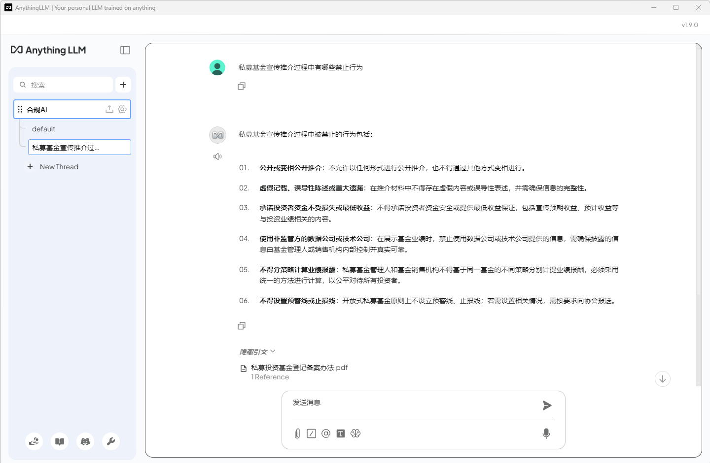

# 1. Ollama和大语言模型（LLM）本地部署

通过Ollama来管理和运行LLM，优点是模型和数据都在本地处理，无需联网，保障了数据隐私和安全。最新版本Ollama安装完成后有GUI界面，早期版本无GUI，直接在命令行运行。

## 1.1 Ollama安装


直接点击运行安装即可，没有太多需要注意的。


GUI可以调用gpt-oss:120b-cloud，deepseek-v3.1:671b-cloud，qwen3-coder:480b-cloud等多种云模型（需注册Ollama账号，截至目前云模型提供免费时长额度，但官方已明确后续会收费），或者本地下载多种模型。Ollama支持的模型远不止GUI展示的类型，具体可以参考Ollama Search。

## 1.2 LLM本地部署

### 1.2.1 LLM安装

在cmd中执行 `ollama run model_Name` 即可，会自动下载相关模型。model_Name可以在Ollama官网查看。GUI可以直接选择模型进行提问，模型会自动下载本地。


### 1.2.2 修改模型保存位置的方法

- Ollama下载模型默认保存位置：`C:\Users\[用户名]\.ollama\models`

#### 1.2.2.1 修改环境变量

1. 创建新文件夹：在你希望的磁盘位置（如D盘或E盘）创建一个用于存放模型的文件夹，例如 `D:\OllamaModels`。
2. 设置环境变量：
   - Windows系统："开始"菜单搜索"编辑系统环境变量" -> 打开"环境变量"窗口 -> 在"用户变量"或"系统变量"区域点击"新建" -> 变量名填入 `OLLAMA_MODELS`，变量值填入刚创建文件夹的完整路径（如 `D:\OllamaModels`）。
   - Linux/macOS系统：可以将导出命令（例如 `export OLLAMA_MODELS=/path/to/your/models`）添加到 shell 配置文件（如 `~/.bashrc` 或 `~/.zshrc`）中。
3. 重启Ollama：设置完成后，需要重启Ollama应用（完全退出后台程序再重新启动），新的环境变量才会生效。

#### 1.2.2.2 GUI修改


在Settings中将Model location修改到合适的位置。

### 1.2.3 Ollama常用命令

```bash
# 查看所有本地模型列表
ollama list

# 查看模型详细信息
ollama show model_Name

# 拉取模型
ollama pull model_Name

# 运行模型
ollama run model_Name

# 停止模型运行
ollama stop model_Name

# 删除本地模型
ollama rm model_Name
```

### 1.2.4 检查模型是否正确使用GPU

在Ollama中输入一个问题，然后在资源管理器中查看性能中的GPU是否有明显的资源占用。如果token输出速度极低，或者GPU资源占用没有发生变化，需要检查是否已安装正确的驱动。

# 2. Anything LLM配置

Anything LLM可以更方便的将LLM和RAG结合，实现基于知识库的人工智能。

## 2.1 Anything LLM安装

官网下载安装，没有太多需要注意的。


## 2.2 Anything LLM配置

- 点击左下角扳手图标
- 大语言模型（LLM）
  LLM提供商选择Ollama，Ollama Model选择通过Ollama获取的本地部署的模型。


- 向量数据库
  根据实际需求配置，小项目AnythingLLM默认自带的LanceDB即可。


- 嵌入器（Embedder）
  嵌入器是将文本转换为矢量的模型。具体的Embedder模型根据实际需求选择，这里选择了mxbai-embed-large。（在命令行中输入 `ollama pull mxbai-embed-large` 获取）
  Max embedding chunk length的设置需要根据实际情况选择，法律文档建议从512开始测试，检查回答质量。


- 文本分割
  文本块大小和文本块重叠根据实际情况选择，法律文档建议从256和64开始，检查回答质量。


## 2.3 工作区配置

### 知识库管理

1. 点击主界面左侧+号，新建工作区
2. 点击上传图标，选择作为知识库的文件
3. 全选文件并移动到工作区
4. 保存并嵌入


Anything LLM会自动根据选择的嵌入器及相关配置将文档向量化，并本地保存。

### 工作区设置

1. 点击工作区设置
2. 在聊天设置中配置工作区LLM：
   - 聊天模式选择"查询"
   - 系统提示词根据实际需求编辑
   - 查询模式拒绝响应根据需求设置
   - LLM温度根据实际需求调整（注意：LLM温度与LLM自身有关，设置前需先行查阅可接受的有效值范围）

# 3. 示例问答


