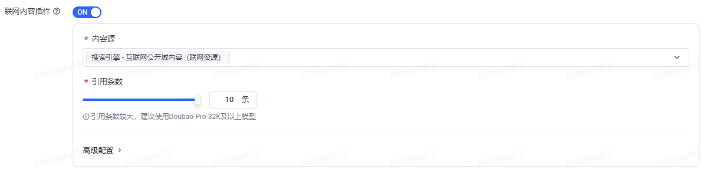

# 【笔记】联网版DeepSeek API

DeepSeek官网不便实现批量化任务，API又不能实现联网搜索获取最新信息的功能，所以需要一个可以联网搜索的DeepSeek API来更好的完成工作里的任务。火山方舟提供的应用可以很好的解决以上问题。

在火山方舟（<https://www.volcengine.com/product/ark>）主页：

*   点击控制台

*   在左侧选择应用广场

*   找到联网增强|DeepSeek-V3-1-terminus联网搜索版

*   右上角点击复制

*   （可选）修改名称

*   联网内容插件点击打开，并进行配置，高级配置选项酌情修改（目前该功能免费）

    

*   右上角点击发布

*   返回火山方舟控制台，在左侧我的应用里可以看到新发布的应用，记录下方应用ID，以bot-开头

*   左侧API Key管理中创建API Key，记录API Key

*   安装OpenAI SDK

```python
pip install --upgrade "openai>=1.0"
```

*   API连接和使用如下，API响应是结构化的JSON数据，generated\_text为markdown格式，可以改为text

```python
from openai import OpenAI

client = OpenAI(
    # 此为默认路径，您可根据业务所在地域进行配置
    base_url="https://ark.cn-beijing.volces.com/api/v3/bots",
    # 从环境变量中获取您的 API Key
    api_key=os.environ.get("ARK_API_KEY") #API Key
)

completion = client.chat.completions.create(
    model="bot-20251127143733-r79qh",  # 应用ID
    messages=[
        {"role": "system", "content": "你是一个专业的Python程序员。"},
        {"role": "user", "content": "写一个Hello world程序。"},
    ],
)
generated_text = completion.choices[0].message.content
```

